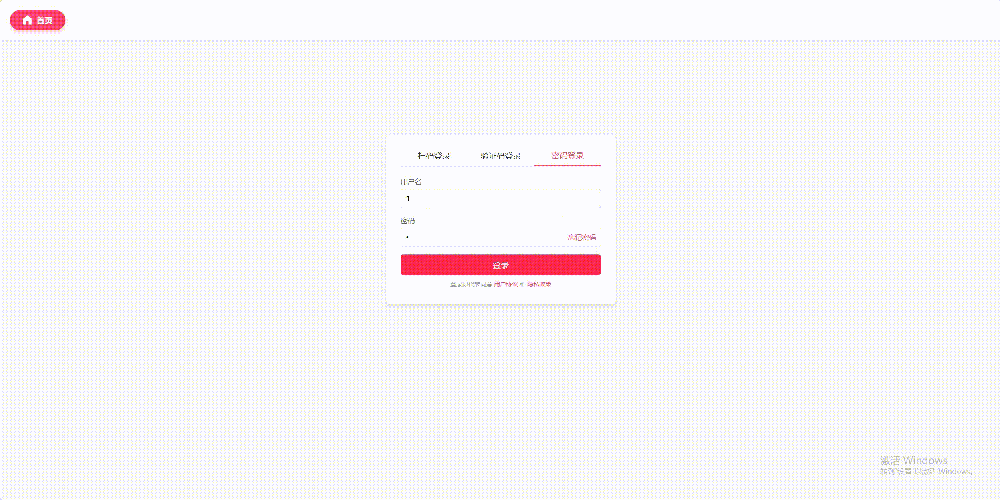
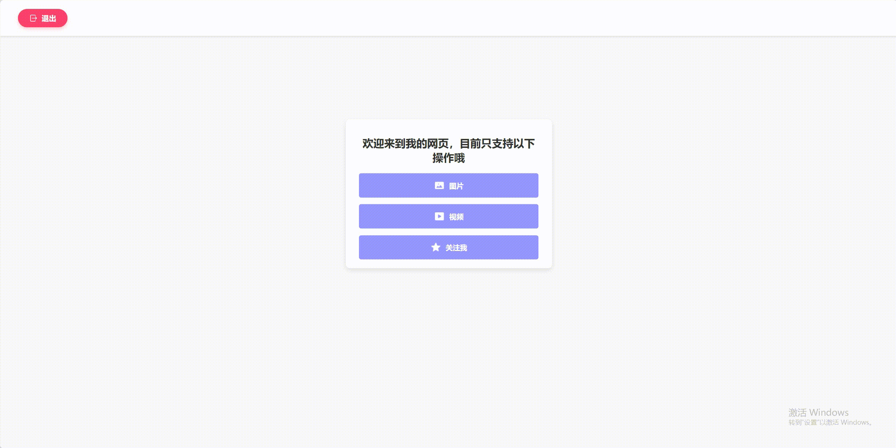

## 目录
- [目录](#目录)
- [概述](#概述)
- [快速入门](#快速入门)
- [效果展示](#效果展示)
  - [电脑端网页浏览](#电脑端网页浏览)
  - [移动端网页浏览](#移动端网页浏览)
- [首次使用](#首次使用)
- [《Linux 高性能服务器编程》阅读笔记](#linux-高性能服务器编程阅读笔记)
- [其他参考](#其他参考)
- [版权与免责声明](#版权与免责声明)

## 概述
`myWebserver` 是基于 `TinyWebServer` 的一个优化实现项目，对于源代码存在的不足之处，我都给出了**改进的方法**和**改进后的代码**。

源代码地址：[TinyWebServer](https://github.com/qinguoyi/TinyWebServer)

项目具体说明：[语雀](https://www.yuque.com/u39624144/zvaea9/xdkson4kiaas4lx6?singleDoc# ) 或 [CSDN](https://blog.csdn.net/teriri_/category_12820243.html?spm=1001.2014.3001.5482)

## 快速入门
如果你是刚接触此项目的初学者，可以参考以下指南：

[小白视角：一文读懂社长的TinyWebServer](https://www.yuque.com/u39624144/zvaea9/uxmd9dc0wav703te?singleDoc#)

## 效果展示
### 电脑端网页浏览

| 登录 | 图片请求 | 视频请求 |
|------|----------|----------|
|  |  |  |

### 移动端网页浏览

| 登录 | 图片请求 | 视频请求 |
|------|----------|----------|
|  |  |  |

## 首次使用

首先，克隆源代码仓库：
```
git clone https://github.com/bhu619/myWebserver.git
```

然后，执行以下命令检查是否已经安装 MySQL：
```
rpm -qa | grep mysql
```
如果没有任何显示，说明 MySQL 尚未安装。若未安装 MySQL，可以使用以下命令安装：
```
sudo apt-get install mysql-server
```

初始化 MySQL 配置，请参照[链接](https://www.yuque.com/u39624144/zvaea9/cbr8n7reuf3rgw58)。

完成配置后，进入项目目录并编译：
```
cd ~/myWebServer
sh ./build.sh
```

编译完成后，启动服务器：
```
./server
```

打开浏览器，在浏览器中输入（下面两条选择一条输入即可）：
```
localhost:9006
(ip):9006
```

## 《Linux 高性能服务器编程》阅读笔记

以下是我关于 *《Linux 高性能服务器编程》* 的学习笔记： 

[《Linux 高性能服务器编程》总结 - 红茶川的博客 - CSDN博客](https://blog.csdn.net/teriri_/category_12760091.html?spm=1001.2014.3001.5482)

## 其他参考
1. [WebServer 项目解读 / 代码分析 / 改进 — 语雀文档](https://www.yuque.com/u39624144/zvaea9/aqktb26g923rsiv5)
2. [MySQL 入门教程](https://www.yuque.com/u39624144/zvaea9/itwh52xog1cg165i)
3. [什么是 web 服务器？](https://developer.mozilla.org/zh-CN/docs/Learn_web_development/Howto/Web_mechanics/What_is_a_web_server)
4. [基于 Linux 的 web 服务器 — CSDN](https://blog.csdn.net/qq_42370809/article/details/126753879)
5. [从零开始自制实现C++ High-Performance WebServer 全流程记录 — CSDN](https://love6.blog.csdn.net/article/details/123754194)
6. [从零开始实现C++ TinyWebServer — CSDN](https://blog.csdn.net/weixin_51322383/category_12307428.html)

## 版权与免责声明
本项目旨在学习和研究使用，请勿将其用于商业用途。所有代码改进及笔记内容均归作者所有，若有引用请标明来源。